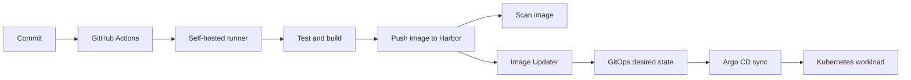

# Building an End-to-End GitOps Pipeline with GitHub Actions, Harbor and Argo CD

A deployment pipeline is not one command that turns a commit into a running service. It is a chain of independently failing steps: a runner accepts the job, tests and builds the application, an image is pushed and scanned, GitOps discovers the new version, and the cluster reconciles it.

The HomeLab delivery work behind this article connected GitHub Actions runners, Harbor, image scanning, Image Updater and Argo CD. The most useful lesson was to make every boundary observable. A green build alone does not prove that the cluster is running the image from that build.

Several failures happened at different points in this chain: a runner could not see a secret in its namespace, a Harbor scan report returned `401`, Image Updater crashed while parsing registry configuration, and the external Harbor URL did not match its tunnel route. These are useful incident examples because they separate workflow scheduling, shell handling, chart configuration and network routing.

## The delivery path

Each arrow is a contract. The source commit must be identifiable in the build, the image must be available to the scanner and cluster, and the desired state must refer to the image that was actually published.

## 1. Make runner scheduling explicit

The first failure boundary is often before a container build starts. A job can remain queued because no runner matches its labels, the runner is offline, or a prior job is still using the available capacity.

Start with the workflow run and answer these questions:

1. Is the job queued, waiting for a runner, or already executing?
2. Which labels and runner group does the job request?
3. Does an online runner advertise the same labels and have permission to use that group?
4. Are the controller, listener and runner Pod healthy in Kubernetes?

This avoids treating every delay as a cluster problem. Scaling a runner set will not fix a label mismatch, and changing labels will not fix a runner Pod that cannot start.

Where independent components build separately, separate jobs can let GitHub schedule work concurrently. Keep shared setup and job dependencies explicit so a faster workflow does not accidentally skip required checks.

One scale set allowed two runners, but one workflow job built two Docker components in series. That meant the workflow graph, rather than ARC capacity, limited parallelism. In a separate production case, ARC's listener had received jobs while runner Pods remained Pending: worker CPU requests were about 1939m/1950m and 1934m/1950m. Increasing worker capacity was proposed, but the available record did not show that plan being applied. Keep these diagnoses distinct: splitting jobs addresses serial workflow work; node capacity addresses Pending Pods.

## 2. Separate build cache from build correctness

BuildKit cache export can fail or stall independently of compilation and tests. When a job stops around cache export, inspect the final completed build step and the cache exporter output before changing Dockerfile logic. A cache miss should make a build slower; it should not silently become the only path to a valid image.

The cache export incident was tracked as its own stage. The evidence to capture is the last completed build step, exporter status and whether a cold-cache build still produces the expected image; do not infer that compilation failed solely because cache export stopped progressing.

The pipeline should preserve enough build output to answer:

- Which commit and workflow attempt produced this image?
- Did tests pass before the image was published?
- Did cache export succeed, fail, or time out?
- Can the image still be built correctly with an empty cache?

## 3. Treat registry push and image scanning as separate jobs

Harbor authentication failures appeared at more than one point in the delivery chain. A push can fail because the build job cannot authenticate to the registry. A scan can fail later because its job has a different environment, permission scope or network path.

Give each job a clear result and diagnose it in its own context. Do not print secret values while debugging; confirm that the expected credential reference exists and inspect the registry response and job logs with secrets masked. A successful `docker push` does not prove that the scanner can access the image.

One Harbor report-fetch job returned `401` even though the credential reference existed. Its robot username contained `$` and had been interpolated into a double-quoted shell command, so the shell expanded part of the value. Moving credentials into job environment variables for trigger, poll and report-fetch calls removed shell interpolation from the command. YAML parsing and `git diff --check` passed; the conversation did not record actionlint or a complete live report fetch, so those should not be claimed as verified.

## 4. Make image identity traceable

Repeated or mutable tags make it hard to tell which build Argo CD should deploy. Use a unique tag derived from the source revision or workflow run, and retain a human-friendly tag only as an additional pointer. Record the image digest in the release evidence when possible: the digest identifies the exact content even if a tag later moves.

The important invariant is:

> The version observed by GitOps must identify the same image that passed the build and scan stages.

## 5. Verify the GitOps handoff

After publishing, check the image updater's discovered version and the resulting desired-state change. Then check Argo CD separately:

1. Did the updater find the new image?
2. Did the desired state change to the intended tag or digest?
3. Did Argo CD detect that change?
4. Did the application become Synced and Healthy?
5. Is the running workload using the expected image?

This sequence localizes the break. If Harbor has the image but the desired state did not change, investigate update tracking and write-back. If desired state changed but Argo CD did not reconcile, investigate repository access, application source and sync policy. If the application synced but the Pod cannot pull, investigate cluster-side registry access.

During one incident the Image Updater controller entered CrashLoopBackOff with `cannot unmarshal !!seq into registry.RegistryList`. The Helm chart expected registry entries under `config.registries` as a list, and the configured API URL should be the registry base URL rather than a URL with `/api/v2.0` appended. Helm rendering and Registry v2 tag access were checked after the correction. The GitOps change had not yet been applied to the live controller in that session, so the runtime recovery remained unverified.

## Operational checklist

- Keep build, push, scan and deployment outcomes visible as distinct stages.
- Match workflow labels to the actual runner registration.
- Test the build without relying on a warm cache.
- Use unique, traceable image identities.
- Confirm the scanner and Kubernetes cluster can each reach the registry.
- Verify the final running image after Argo CD reports a healthy sync.
- Keep credentials in the CI secret store and never include them in logs or examples.

The resulting pipeline is easier to debug because every stage has a concrete success condition. A deployment is complete only after the cluster has reconciled the image that the pipeline built and checked.
