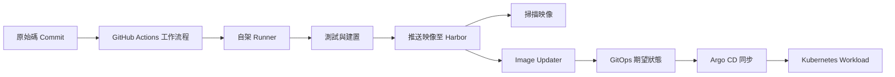

部署流程並不是一個將 Commit 直接變成執行中服務的指令，而是一連串可能各自失敗的步驟：Runner 接受 Job、測試並建置應用程式、推送及掃描映像、GitOps 發現新版本，最後由叢集協調到該版本。

本文整理的 HomeLab 交付流程串接 GitHub Actions Runner、Harbor、映像掃描、Image Updater 與 Argo CD。最重要的經驗是讓每個邊界都可觀測。Build 顯示成功，並不能證明叢集正在執行該次 Build 產生的映像。

這條流程的不同階段曾出現多種故障：Runner 無法在其 Namespace 找到 Secret、Harbor 掃描報告回傳 `401`、Image Updater 解析 Registry 設定時崩潰，以及對外 Harbor URL 與 Tunnel 路由不相符。這些案例能區分 Workflow 排程、Shell 字串處理、Chart 設定與網路路由等問題。

## 交付流程

每個箭頭都代表一份契約：來源 Commit 必須能在 Build 中識別，映像必須能被 Scanner 與叢集取得，而期望狀態必須指向實際發布的映像版本。

## 1. 明確設定 Runner 排程

第一個故障邊界往往出現在容器 Build 開始之前。Job 可能因為沒有 Runner 符合 Label、Runner 離線，或現有容量正被其他 Job 使用而持續排隊。

從 Workflow Run 開始，確認以下問題：

1. Job 正在排隊、等待 Runner，還是已經執行？
2. Job 要求哪些 Label 與 Runner Group？
3. 是否有 Online Runner 宣告相同 Label，並且有權使用該 Group？
4. Kubernetes 中的 Controller、Listener 與 Runner Pod 是否健康？

這可以避免把所有延遲都當成叢集問題。擴大 Runner Set 無法修正 Label 不一致，修改 Label 也無法修正無法啟動的 Runner Pod。

若不同元件可以獨立建置，拆分成不同 Job 可讓 GitHub 平行排程。共用設定與 Job 相依關係仍要明確，避免加快流程時略過必要檢查。

有一個 Scale Set 允許兩個 Runner，但單一 Workflow Job 仍依序建置兩個 Docker 元件，因此限制平行度的是 Workflow 圖，而不是 ARC 容量。另一個獨立的 Production 案例中，ARC Listener 已收到 Job，但 Runner Pod 因 Worker CPU Request 約為 1939m／1950m 與 1934m／1950m 而停在 Pending。當時提議增加 Worker 容量，但紀錄沒有顯示已套用。這兩種診斷要分開：拆 Job 處理序列工作，增加節點容量處理 Pending Pod。

## 2. 區分 Build Cache 與 Build 正確性

BuildKit 匯出 Cache 可能獨立於編譯與測試而失敗或卡住。若 Job 停在 Cache 匯出附近，先查看最後完成的 Build 步驟與 Cache Exporter 輸出，再決定是否修改 Dockerfile。Cache 未命中應讓 Build 變慢，不應默默成為映像能否正確建置的唯一途徑。

Cache 匯出事件應獨立追蹤。請記錄最後完成的 Build 步驟、Exporter 狀態，以及冷 Cache Build 是否仍能產生預期映像；不要只因 Cache 匯出沒有進展，就推定編譯失敗。

流程應留下足夠的 Build 輸出，以回答：

- 這個映像由哪個 Commit 與 Workflow 執行序號產生？
- 發布映像前，測試是否通過？
- Cache 匯出是成功、失敗還是逾時？
- 清空 Cache 後，映像是否仍能正確建置？

## 3. 將 Registry 推送與映像掃描分開處理

Harbor 驗證問題曾出現在交付流程中的不同位置。推送可能因 Build Job 無法通過 Registry 驗證而失敗；掃描則可能因為使用不同環境、權限範圍或網路路徑，在後續階段失敗。

讓每個 Job 都有明確結果，並在其執行情境中排查。除錯時不要輸出 Secret 值；確認預期的 Credential Reference 存在，並在 Secret 已遮罩的狀態下檢查 Registry 回應與 Job 日誌。`docker push` 成功不代表 Scanner 能讀取映像。

有一次 Harbor 報告擷取 Job 回傳 `401`，雖然 Credential Reference 存在。Robot Username 含有 `$`，又被插入雙引號 Shell 命令，導致 Shell 展開了部分值。改用 Job 環境變數傳入 Credential，供觸發、輪詢與擷取報告的請求使用，便可避免命令中的 Shell 插值。YAML 解析與 `git diff --check` 已通過；對話沒有紀錄 actionlint 或完整線上報告擷取，因此不應宣稱已完整驗證。

## 4. 讓映像身分可追溯

重複或可變動的 Tag 會讓人難以判斷 Argo CD 應部署哪一個 Build。使用來源 Revision 或 Workflow Run 產生唯一 Tag，並將易讀 Tag 留作額外參照。若可行，也要在發布證據中記錄映像 Digest：即使 Tag 後續移動，Digest 仍能識別確切內容。

重要的不變條件是：

> GitOps 觀察到的版本，必須指向通過 Build 與掃描的同一個映像。

## 5. 驗證 GitOps 交接

發布映像後，分別檢查 Image Updater 偵測到的版本與期望狀態的變更，再獨立檢查 Argo CD：

1. Updater 是否找到新映像？
2. 期望狀態是否更新為指定 Tag 或 Digest？
3. Argo CD 是否偵測到變更？
4. Application 是否成為 `Synced` 與 `Healthy`？
5. 執行中的 Workload 是否使用預期映像？

依序檢查可以定位中斷點。如果 Harbor 已有映像，但期望狀態沒有更新，就查 Tag 追蹤與 Write-back；如果期望狀態已變更但 Argo CD 沒有同步，就查 Repository 存取、Application Source 與 Sync Policy；如果 Application 已同步但 Pod 拉不到映像，就查叢集端的 Registry 存取。

一次事件中，Image Updater Controller 因 `cannot unmarshal !!seq into registry.RegistryList` 進入 CrashLoopBackOff。Helm Chart 預期 `config.registries` 下的 Registry 項目為 List，而且 API URL 應是 Registry Base URL，不應附加 `/api/v2.0`。修正後曾檢查 Helm 渲染結果與 Registry v2 Tag 存取；但該次對話尚未將 GitOps 變更套用到線上 Controller，因此 Runtime 是否恢復仍未確認。

## 營運檢查清單

- 將 Build、Push、Scan 與 Deploy 的結果分成可觀察的階段。
- 讓 Workflow Label 與 Runner 實際註冊的 Label 相符。
- 確認冷 Cache 下仍可完成 Build。
- 使用唯一且可追溯的映像識別碼。
- 分別確認 Scanner 與 Kubernetes 叢集都能連線到 Registry。
- Argo CD 顯示健康同步後，再確認 Workload 使用的映像版本。
- 將 Credential 存放在 CI Secret Store，絕不寫入日誌或範例。

各階段都有明確成功條件，交付流程就更容易除錯。只有在叢集已協調到流程建置並檢查過的映像後，部署才算完成。
